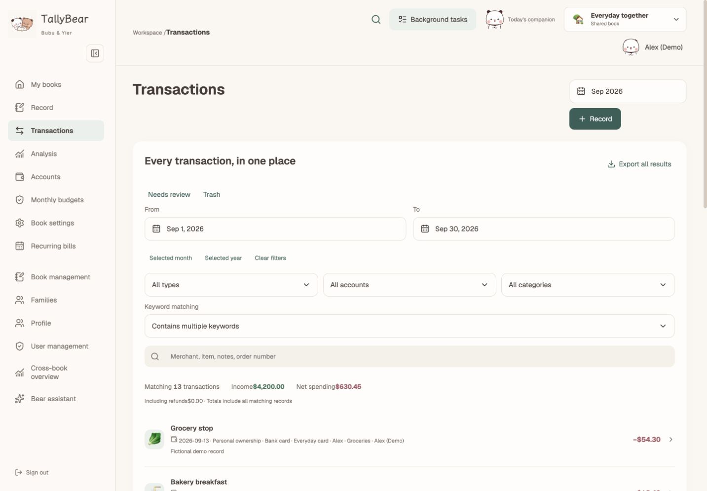

<p align="center">
  
</p>
<h1 align="center">TallyBear</h1>
<p align="center"><strong>Your receipts, understood. Your finances, in view.</strong></p>
<p align="center">AI-powered personal &amp; family finance. Self-hosted, with a little bear companionship.</p>
<p align="center">
  English · <a href="README.zh-CN.md">简体中文</a><br/>
  <a href="https://github.com/JYao-Chen/TallyBear/releases"></a>
  <a href="LICENSE"></a>
  
</p>

## Less typing. More understanding.

Drop in a receipt, a long screenshot, or several pages of an order. TallyBear prepares editable records, keeps the item details, checks totals and highlights possible duplicates. Review the result, save it, then ask your assistant what the numbers mean.

**Images → structured drafts → amount checks → your confirmation → financial insights.**

<table>
<tr>
<td width="33%" align="center"><br/><strong>Capture the details</strong><br/>Receipts, screenshots, line items and checkout discounts.</td>
<td width="33%" align="center"><br/><strong>Check before saving</strong><br/>Duplicate suggestions, refunds and item-total reconciliation.</td>
<td width="33%" align="center"><br/><strong>Ask your finances</strong><br/>Tool-backed answers, charts and reports you can keep.</td>
</tr>
</table>

## What makes TallyBear different?

### 🧾 From scattered images to useful records

- **Batch and cross-image recognition.** Multiple orders in one image, one order across several images, and long receipts.
- **Details that stay useful.** Merchant-led titles, concise product summaries, quantities, prices, discounts and additional fees.
- **Checks beyond OCR.** Compare item totals with the amount paid; retry inconsistent recognition and leave unresolved differences for review.
- **Duplicate-aware review.** Suggest matches against existing entries and consolidate complementary order evidence without blindly treating equal amounts as duplicates.
- **Refund-aware records.** Link full or partial refunds to the original purchase. Transfers are not income or spending.

### ✨ A financial assistant with tools

Ask “Compare this month with last month” or “Show my largest expenses.” The assistant can query authorized book data, inspect drafts, delegate recognition/reconciliation/analysis, generate charts and save reports.

- LangGraph coordinates the assistant and its specialist tools.
- Configure OpenAI-compatible endpoints, text/vision models and connection tests in the admin interface.
- Durable jobs run in the background, with progress, retry controls and adjustable concurrency. Closing the browser does not cancel processing.
- AI prepares drafts for your confirmation; it does not execute real payments or bank transfers.

### 🏡 Personal privacy, shared household context

Independent accounts, families with multiple books, private books and explicitly shared books. Keep personal and shared wallets separate. Reuse a transaction in multiple books, with linked-event deduplication in cross-book totals. Application administrators do not automatically gain access to private books.

### 📊 Everyday money, in one place

Budgets · account balances · spending breakdowns · daily/weekly/monthly/yearly recurring plans · exact minor-unit cost allocation · search including receipt line items · optional compressed vouchers and personal transaction photos.

### 🐻 A companion, or a clean workspace

Choose the illustrated **Bubu & Yier** theme or a **minimal** appearance. The bundled library includes **564 animated stickers** for categories, avatars and book identities, with static alternatives for reduced-motion preferences.

<p align="center"> &nbsp; </p>

## See it in action

Real browser captures of TallyBear running in an isolated demo deployment. All names and transactions shown are fictional. Desktop: 1440 × 1000 viewport; mobile: 390 × 844 viewport. Full-page captures may be taller.


<table><tr><td width="50%" align="center"><strong>Mobile overview</strong><br/></td><td width="50%" align="center"><strong>Receipt details</strong><br/></td></tr></table>

<details><summary>More desktop screenshots</summary>




</details>

## Quick start

Requires **Docker with Compose v2** and **Node.js 22** for the setup helper.

```sh
git clone https://github.com/JYao-Chen/TallyBear.git
cd TallyBear
npm run setup
```

Open the generated `.env`. It contains unique database credentials, an encryption key and your initial `ADMIN_PASSWORD`. Set these deployment preferences **before starting**:

```dotenv
APP_ORIGIN=http://localhost:3016
APP_LANGUAGE=en
APP_CURRENCY=USD
ADMIN_USERNAME=admin
```

```sh
docker compose up -d --build
```

Open **http://localhost:3016** and sign in with `ADMIN_USERNAME` and the generated `ADMIN_PASSWORD`. Create a book, then configure the AI provider in settings if you want recognition and chat. Manual bookkeeping does not require an AI key.

For public access, place an HTTPS reverse proxy in front of the localhost-bound port and set `APP_ORIGIN` to the exact external origin. [Deployment guide →](docs/deployment.md)

## Language & currency

| Setting | Supported values |
|---|---|
| `APP_LANGUAGE` | `en`, `zh-CN` |
| `APP_CURRENCY` | `USD`, `EUR`, `GBP`, `CNY` |

The setup helper defaults to **English + USD**. Language and currency are deployment-wide; there is no in-app selector. UI, generated AI summaries, chart labels and exports follow the language setting. User-entered text and merchant names are preserved.

Each database uses **one currency**, stored as integer minor units. This is not multi-currency accounting or FX conversion. A configuration/database currency mismatch is rejected. WeChat and Alipay CSV import is supported for CNY deployments; foreign bank synchronization is not included.

## Configure your AI assistant

1. Sign in as an administrator and open **Book settings**. Configure the AI provider and background-task concurrency there.
2. Set the provider's OpenAI-compatible **base URL** (usually ending in `/v1`), API key, text model and vision model. TallyBear appends `/chat/completions` itself; do not paste that full endpoint as the base URL.
3. Use a text model that supports **tool calling and streaming**, and a vision model that accepts **image inputs**. These can be the same model if it supports both.
4. Test the connection. Text and image support are checked separately; a successful text response does not establish image support.
5. Start with a small receipt in **Record → AI text / screenshots**, review its items and amount, then select the actual funding account before saving.

Model IDs are configurable, not hard-coded. An OpenAI-compatible endpoint is required; native Claude/Codex SDK authentication and browser subscriptions are not accepted as API credentials. The assistant operates on the books the signed-in user may access. [AI and bookkeeping guide →](docs/user-guide.md)

## How the numbers work

| Situation | TallyBear's treatment |
|---|---|
| A receipt says “Alipay” but not which wallet/card paid | Preserve the platform; choose the actual account when confirming the draft. OCR does not guess a funding account. |
| Items total $60 with a $2 checkout discount | Keep the items and a negative discount row; record $58 paid. |
| A returned purchase is refunded | Link the received refund to its purchase; reduce spending rather than count salary-like income. |
| You pay a household expense from your own card | Use the personal funding account in the shared book. Wallet ownership and book visibility are separate. |
| The same payment belongs in two books | Use **Record in another book too**, which preserves the shared event identity. Independently entered lookalikes are not automatically deduplicated across books. |
| A $100 subscription covers 12 months | Allocate integer cents across the selected period so the allocations sum to exactly $100. The actual payment still occurs once. |

## Project layout

| Location | Responsibility |
|---|---|
| `src/app` | Next.js pages and API routes |
| `src/components` | Responsive UI, forms, charts, receipt review and chat |
| `src/server` | Permissions, transactions, recognition, reconciliation, jobs and AI tools |
| `src/lib` | Locale/currency helpers, domain rules and shared types |
| `scripts/worker.ts` | Long-running background worker |
| `scripts/schema.sql` | PostgreSQL schema and idempotent updates |
| `public/brand`, `public/stickers` | Brand assets and optional sticker theme |
| `tests` | Money calculations, validation, models and UI behavior tests |

## Frequently asked questions

**Does it connect directly to my bank?** No. Upload receipts, enter transactions, or import supported WeChat/Alipay CSV files. No payment execution or live bank sync is included.

**Will work stop if I close the page?** Queued jobs continue in the worker. Keep both web and worker running; progress and saved results are available when you return.

**Can I use it without AI or bears?** Yes. Manual bookkeeping works without model credentials, and users can choose the minimal theme.

**Is it an Actual Budget skin?** No. TallyBear runs its own Next.js application, API, PostgreSQL data model and worker. It does not require Actual Budget. An automatic Actual database importer is not included.

**Can I change currency later?** Not by relabeling existing money. Each database has one currency; start a new deployment for another currency. Currency conversion and mixed-currency balances are outside v1.0.

## Development

```sh
npm ci
npm run setup                         # only if .env does not exist
docker compose -f compose.yaml -f compose.dev.yaml up -d db
node --env-file=.env scripts/init.mjs
npm run dev
```

In a second terminal:

```sh
node --env-file=.env --import tsx scripts/worker.ts
```

```sh
npm run typecheck
npm test
npm run build
```

**Stack:** Next.js App Router · React · TypeScript · PostgreSQL · LangGraph · Recharts · Sharp. Web and worker share a database and persistent image storage. [Contributing →](CONTRIBUTING.md)

## Data & AI

Book permissions are enforced by the application; this is not end-to-end encryption against the server operator. AI requests send submitted images/text and the authorized context needed for the task to your configured provider. Keep the encryption key with your backups. Model availability, accuracy and charges depend on that provider.

Image vouchers are optional. Saved transaction images persist; unreferenced temporary uploads are cleaned after seven days. Back up the database, persistent receipts and configuration together. [Operations →](docs/deployment.md#backups)

## Contribute

Useful bug reports, receipt-format examples with personal information removed, translations and UI improvements are welcome. Start with an [issue](https://github.com/JYao-Chen/TallyBear/issues) or read [CONTRIBUTING.md](CONTRIBUTING.md).

If TallyBear makes your bookkeeping easier, a ⭐ helps others discover it.

## License & credits

Application code: [MIT](LICENSE). Fonts, third-party logos and character artwork are listed separately in [THIRD_PARTY_NOTICES.md](THIRD_PARTY_NOTICES.md). TallyBear is an independent application, not an official Bubu & Yier product.
