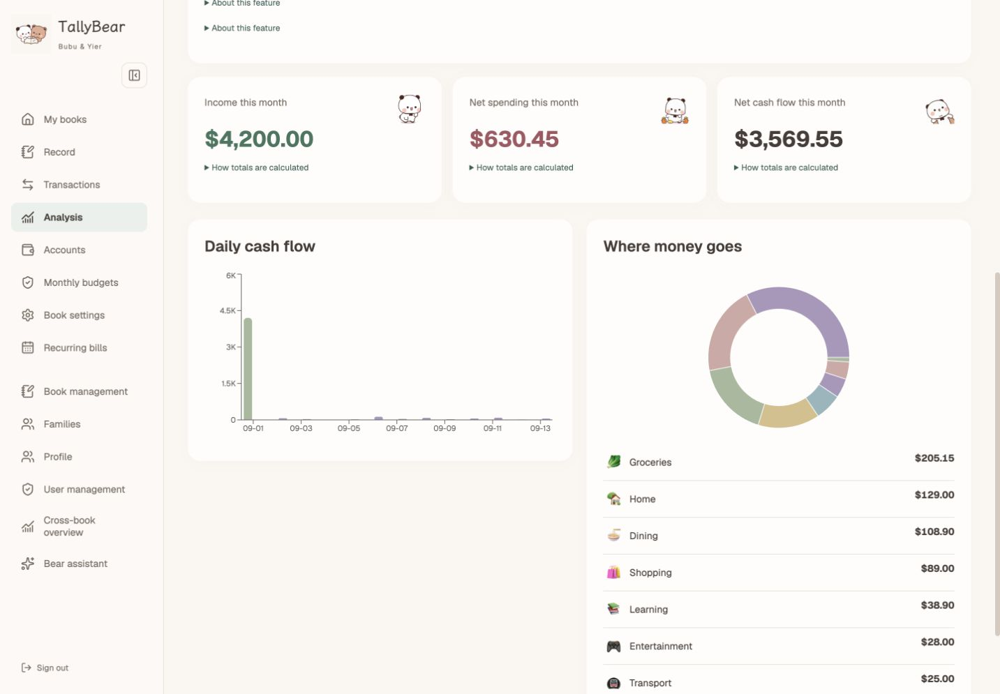
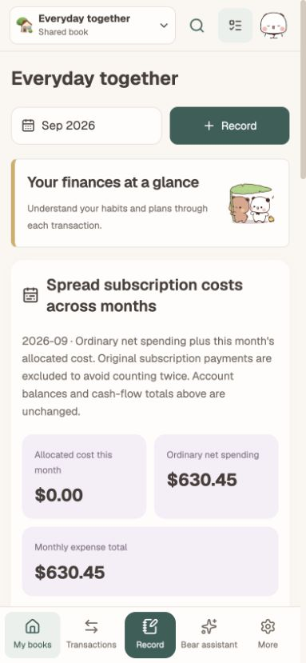
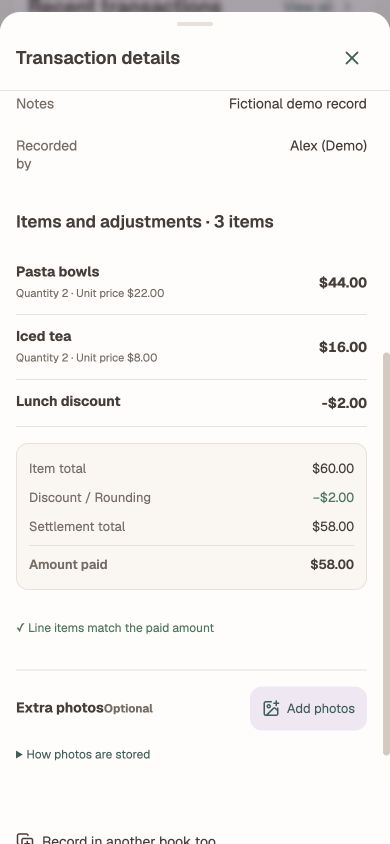
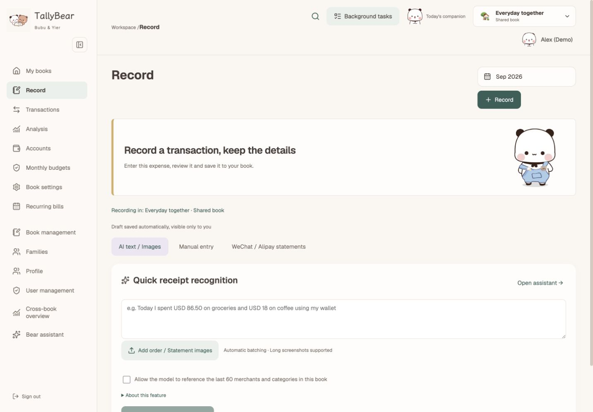
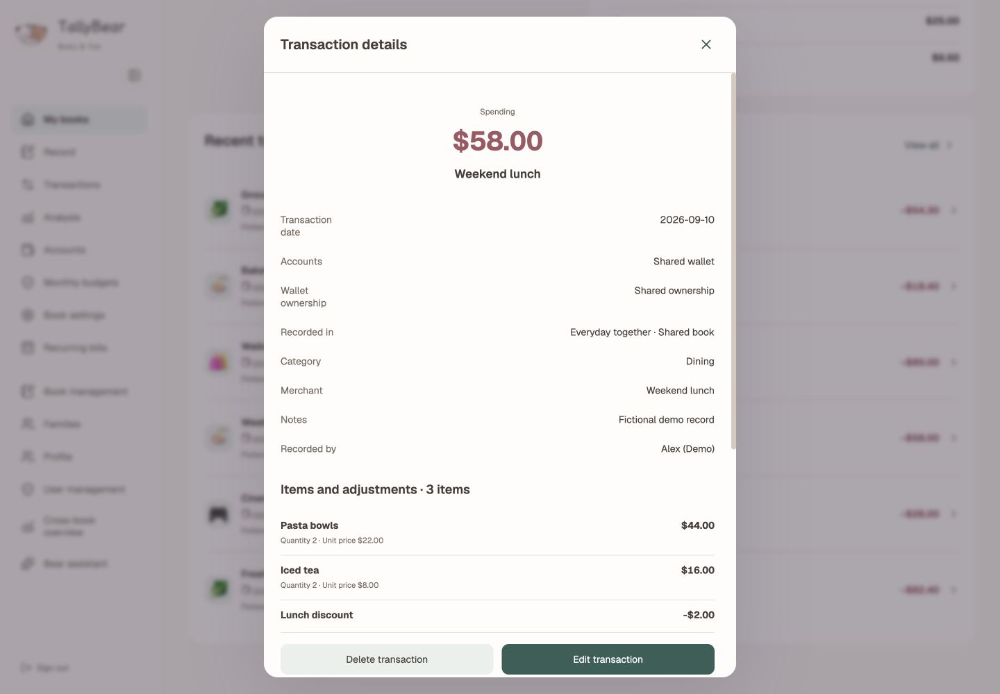
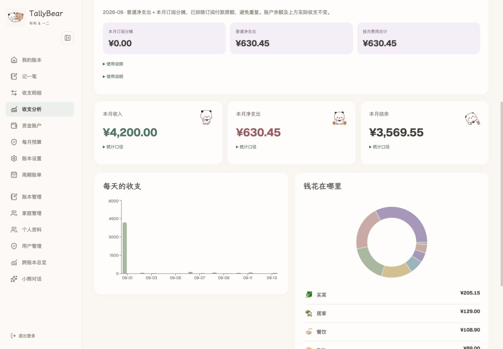
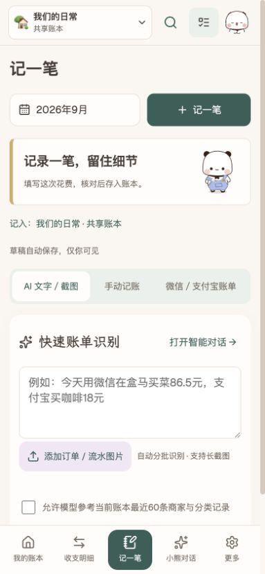
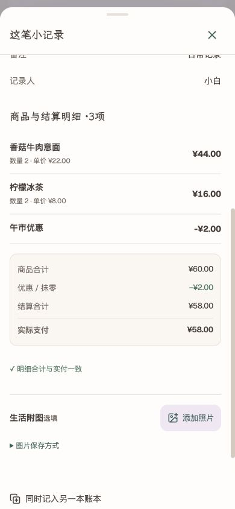

<div align="center">


# TallyBear

**Your receipts, understood. Your finances, in view.**

An AI-powered personal and family finance app with a **Bubu & Yier (布布一二 / 一二布布) bear theme**.
Self-hosted · Itemized receipts · Financial conversations · Bubu & Yier companions

English · [简体中文](README.zh-CN.md)

[](https://github.com/JYao-Chen/TallyBear/releases/tag/v1.0.0)
[](LICENSE)
[](docs/deployment.md)

[Get started](#get-started) · [Explore the features](#from-receipt-to-insight) · [Deployment guide](docs/deployment.md) · [Latest release](https://github.com/JYao-Chen/TallyBear/releases)

</div>

**Bookkeeping with Bubu & Yier.** White and brown bear illustrations, animated stickers and customizable category icons bring a playful touch to everyday finances. Choose the bear theme or switch to a clean, minimal interface.



## From receipt to insight

Drop in your receipts. Review the details. Ask what your money is doing.

<table>
<tr>
<td width="33%" align="center">
<br/>
<strong>01 · Capture</strong><br/>
Images become editable records.<br/>Keep the merchant, items and discounts.
</td>
<td width="33%" align="center">
<br/>
<strong>02 · Reconcile</strong><br/>
Check totals and spot duplicates.<br/>Bring related pages into one order.
</td>
<td width="33%" align="center">
<br/>
<strong>03 · Understand</strong><br/>
Ask questions, explore charts.<br/>Save the reports that matter.
</td>
</tr>
</table>

### Keep every useful detail

Upload multiple images or a long screenshot. TallyBear groups related orders, extracts line items, summarizes product names and compares the checkout total with the amount paid. Review editable drafts and duplicate suggestions before saving.

- **Itemized purchases** — quantities, unit prices, checkout discounts and extra fees.
- **Refunds** — full or partial refunds linked to the original purchase.
- **Search & memories** — search merchants, categories and individual items; attach compressed vouchers or everyday photos.

### Consistent entries for everyday spending

Transport, dining, shopping and groceries share structured forms across AI drafts, manual entry and saved presets. Stations, merchants, branches, meal types and product summaries produce concise titles while unknown facts stay blank. Optional preference matching selects relevant, deduplicated examples from the current book and your presets; the model resolves category ambiguity without filling missing prices or routes from history.

### A conversation that works with your books

> “Compare this month with last month, show where spending changed, and save a report.”

A LangGraph-powered assistant queries your accessible books, coordinates recognition and reconciliation tools, generates charts and saves reports. Background jobs keep running between visits, with live progress, retries and administrator-controlled concurrency.

Choose your own OpenAI-compatible provider and text/vision models, then test the connection in settings.

### Your money, your household, your view

| What you want to manage | How TallyBear helps |
|---|---|
| Personal and shared finances | Independent users, families, private books and shared books. |
| Who paid | Assets belong to a person or family, independently of books. Choose the actual payment account when recording an expense; moving or reusing an entry preserves that account and counts its movement once. |
| Different reporting views | Link one transaction to several books and count that event once in cross-book totals. |
| Subscriptions and plans | Flexible daily, weekly, monthly and yearly periods; exact cost allocation and category budgets. |
| Your preferred workspace | English or Chinese deployment, familiar currency formatting and responsive desktop/mobile layouts. |

## A little company for everyday money

Choose the Bubu & Yier theme for warm colors and **564 animated stickers**, or switch to a minimal workspace. Use the sticker library for avatars, categories and book identities.

<p align="center"> &nbsp; </p>

<table>
<tr>
<td width="50%" align="center"><strong>Your book, on the go</strong><br/><br/></td>
<td width="50%" align="center"><strong>Every item adds up</strong><br/><br/></td>
</tr>
</table>

<details>
<summary><strong>Explore the desktop workspace</strong></summary>

#### AI intake


#### Receipt details


</details>

<details>
<summary><strong>简体中文 · Chinese interface</strong></summary>



<p align="center"> &nbsp; </p>

</details>

## Technology & AI architecture

TallyBear combines a **Next.js full-stack app, PostgreSQL and a dedicated job worker**. The UI and API share TypeScript domain types. Transactions, permissions, job progress and reports live in PostgreSQL; Sharp compresses images into persistent attachment storage.

| Layer | Technology | Responsibility |
|---|---|---|
| Interface | React · Next.js App Router | Responsive entry, draft review, conversations and book management |
| Business & data | Next.js API · PostgreSQL | Permissions, transactional writes, balances, cost allocation and deduplicated totals |
| AI collaboration | LangGraph · tool calling | A supervisor delegates receipt reading, reconciliation and analysis |
| Background execution | Node.js worker · PostgreSQL queue | Durable jobs, progress, retries and configurable concurrency |
| Artifacts & images | Recharts · Markdown · Sharp | Conversational charts, saved reports and compressed vouchers |

### A supervisor with specialist agents

Conversations use a **supervisor + specialists** architecture. Each agent follows a LangGraph loop of model decisions, tool execution and follow-up decisions. The supervisor answers simple questions with tools or delegates focused tasks, then uses the returned evidence to continue or summarize.

| Agent | Capabilities | What you get |
|---|---|---|
| Supervisor | Understand requests, select tools, delegate and synthesize | One continuous conversation about your finances |
| Recognition | Read images and text; assemble orders across images | Merchant titles, line items, discounts and editable drafts |
| Reconciliation | Inspect drafts, find duplicates, check refunds and totals | Reviewable differences, duplicate matches and linking suggestions |
| Analysis | Query transactions, accounts, budgets and allocations; draw charts | Data-backed explanations, charts and reports |

**AI interprets the content; business tools calculate the money.** Chart tools query ledger aggregates directly, and amounts use integer minor units. Models select useful questions and explain results. Receipt processing combines structured extraction with amount checks to produce reviewable entries.

Specialists share the current drafts and previous findings through the supervisor. The background queue processes concurrent jobs, while conversations display processing stages, tool activity and streamed answers. Work continues between visits. Provider endpoints, text and vision models, and queue concurrency are configurable.

The result connects **capture → reconcile → save → analyze**: less manual transcription, visible duplicate and amount checks before confirmation, and financial questions turned into charts and reports you can keep.

## Get started

You’ll need **Docker Compose v2** and **Node.js 22** for the setup helper.

```sh
git clone https://github.com/JYao-Chen/TallyBear.git
cd TallyBear
npm run setup
```

Set your language, currency and address in the generated `.env`:

```dotenv
APP_ORIGIN=http://localhost:3016
APP_LANGUAGE=en
APP_CURRENCY=USD
```

```sh
docker compose up -d --build
```

Open [**localhost:3016**](http://localhost:3016). Sign in with `ADMIN_USERNAME` and the generated `ADMIN_PASSWORD` from `.env`, create your first book, and start recording.

<details>
<summary><strong>Language, currency & public deployment</strong></summary>

| Setting | Options |
|---|---|
| `APP_LANGUAGE` | `en` · `zh-CN` |
| `APP_CURRENCY` | `USD` · `EUR` · `GBP` · `CNY` |

The setup helper defaults to English and USD. Each deployment uses one language and one currency. The interface, AI-generated summaries, charts and exports follow the selected language. Amounts are stored as integer minor units. CNY deployments also support WeChat and Alipay CSV imports.

For public access, configure an HTTPS reverse proxy and set `APP_ORIGIN` to your public origin.

[Deployment, storage and backups →](docs/deployment.md)

</details>

<details>
<summary><strong>Connect your AI provider</strong></summary>

1. Open **Book settings** as an administrator.
2. Enter an OpenAI-compatible base URL ending in `/v1`, an API key, and your text/vision model IDs.
3. Choose a text model with tool calling and streaming, and a vision model with image input.
4. Run the text and image connection tests, then set background concurrency.
5. Open **Record → AI text / screenshots**, upload a receipt, review the draft and choose its funding account.

[Bookkeeping and AI guide →](docs/user-guide.md)

</details>

<details>
<summary><strong>Develop with TallyBear</strong></summary>

**Next.js App Router · React · TypeScript · PostgreSQL · LangGraph · Recharts · Sharp**

The Next.js app serves the UI and API. A separate worker processes durable jobs, sharing PostgreSQL and persistent image storage with the web app.

```sh
npm ci
npm run setup
docker compose -f compose.yaml -f compose.dev.yaml up -d db
node --env-file=.env scripts/init.mjs
npm run dev
```

Start the worker in another terminal:

```sh
node --env-file=.env --import tsx scripts/worker.ts
```

```sh
npm run typecheck
npm test
npm run build
```

[Contribution guide →](CONTRIBUTING.md)

</details>

---

<div align="center">

**Make room for the next little improvement.**

Ideas, translations, receipt formats and thoughtful pull requests are welcome.

[Share an idea](https://github.com/JYao-Chen/TallyBear/issues) · [Contribute](CONTRIBUTING.md) · [Changelog](CHANGELOG.md)

Enjoying TallyBear? A ⭐ helps others find their new bookkeeping companion.

[MIT](LICENSE) · [Credits & artwork](THIRD_PARTY_NOTICES.md)

</div>
