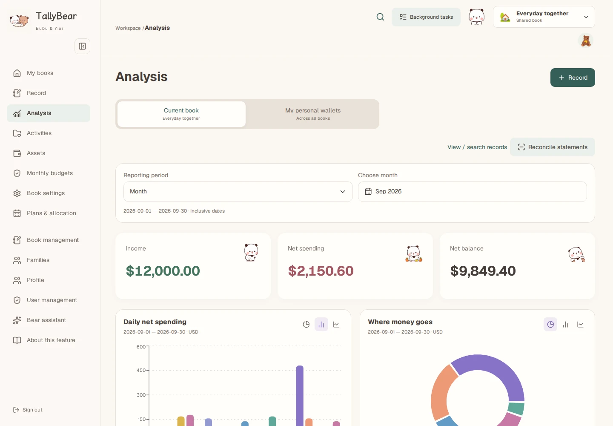
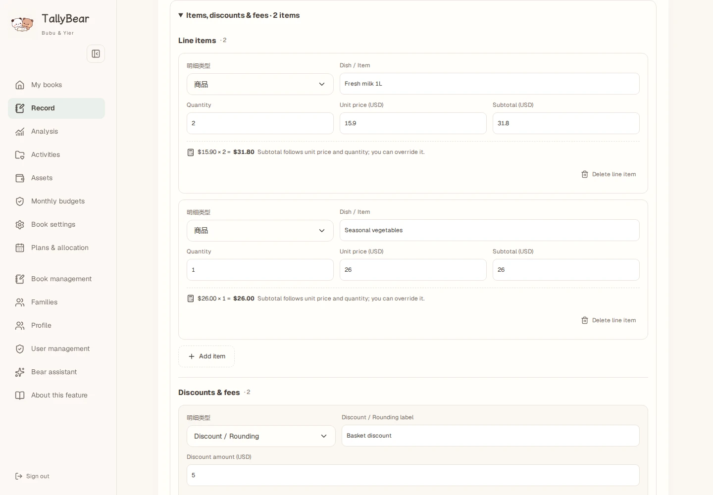
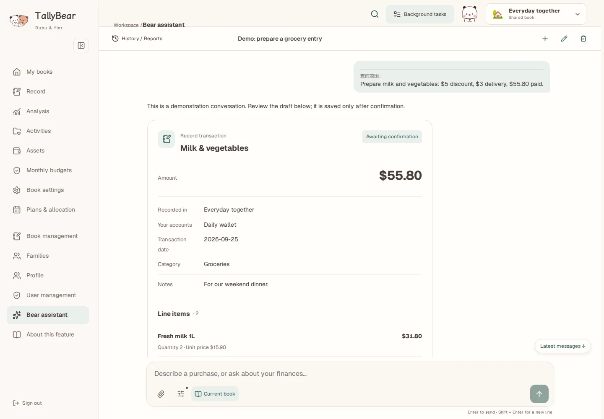
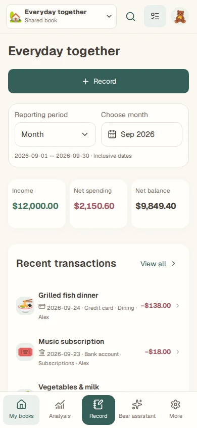
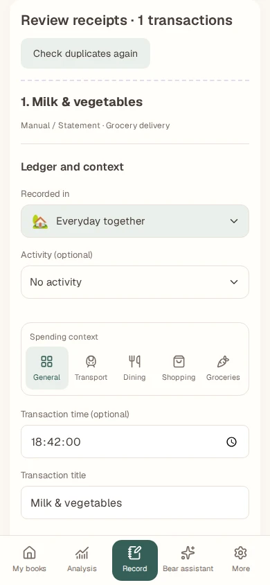

<div align="center">


# TallyBear

**Personal and family bookkeeping, with AI-assisted entry and financial memory.**

Self-hosted · Multiple books · Independent wallets · Shared activities · English / 简体中文

English · [简体中文](README.zh-CN.md)

[](CHANGELOG.md)
[](LICENSE)

[Features](#what-you-can-do) · [Screenshots](#desktop-and-mobile) · [Quick start](#quick-start) · [Documentation](#documentation)

</div>

TallyBear brings receipts, cash flow and shared spending into one place. Enter a transaction manually, import a bill or describe it to the assistant; review an editable draft before saving. Track the money in your own wallets separately from the books where you organize purchases.

The current version is **2.0**. It includes the current financial-memory system, cross-book activities, unified charts and records, conversational management, and the redesigned receipt cards. The optional Bubu & Yier bear theme can be replaced with a minimal interface.



## What you can do

### Record a purchase without losing its details

- **Manual, text and image entry.** Review AI-generated drafts, or import WeChat / Alipay bill files. Drafts persist while you move between pages.
- **Long receipts and multiple images.** Images are split for recognition; order-level checking can combine complementary fragments into one purchase. Ambiguous orders stay available for review.
- **Products and checkout adjustments.** Quantity, unit price and subtotal belong to products. Coupons, discounts, packaging, delivery and service fees have a separate section.
- **A built-in calculator.** Unit price × quantity recommends a subtotal. Changes follow the calculation when the subtotal has not been independently overridden. Manual and recognized amounts are preserved; applying a recommended payment total is an explicit action.
- **Structured payment facts.** Dates use `YYYY-MM-DD`; missing dates default to the recording date. Time is separate and optional. Order IDs and payment/refund references are optional and searchable.
- **Linked refunds and cashback.** Search across accessible books to select the original purchase, reuse its known details, then enter the refund. Multiple refunds can exceed the original amount; negative net spending is retained.



### Keep books, wallets and activities separate

| Concept | What it answers | Example |
|---|---|---|
| Book | Where should this record be organized, and who may see it? | Personal journal or a shared household book |
| Wallet | Where did the money actually move? | Bank account, cash, payment wallet or credit account |
| Activity | What trip, event or project did it belong to? | A weekend trip containing entries from several books |
| Category | What was purchased? | Dining, transport, groceries or subscriptions |

Personal-wallet reporting combines the signed-in user's own wallets across books. Linking an existing payment to another book does not turn it into a second payment. Activities group records without owning or duplicating them.

Activities support types, dates, budgets, family participation, an archive view, reactivation and deletion. Deleting an activity removes its associations, not the original transactions. Family participation does not grant access to private books.

### Explore the numbers and the underlying records

**Spending analysis** combines charts, filters, search and paginated transactions. Choose a year, month, week, day or custom range, then inspect categories and daily trends. Click a chart result to reach the corresponding records and their full details.

**Assets** adds balance distribution and cash-flow charts to wallet management. Personal and family-owned wallets have separate scopes. Balance corrections are recorded as adjustments; statement reconciliation helps investigate missing or duplicate records before changing a balance.

**Monthly budgets** retain a monthly basis. Recurring bills, installment purchases, repayments and cost allocation are managed under **Plans & allocation**. Repayment principal and transfers are distinct from new consumption; interest and fees need their appropriate treatment.

### Ask the assistant, then confirm the action

The assistant can search accessible books, explain reports, inspect statements and prepare changes. Supported operations include entries, refunds, wallets, activities, categories, budgets, plans, family management and memory.

Messages and their scope are saved on send. Background jobs continue after you leave the conversation. Action cards distinguish the payment summary, items, adjustments, missing fields, warnings and processing notes. Editing a card is separate from confirming it; bookkeeping changes still require confirmation.

The assistant uses the same permission-checked business handlers as the interface. Passwords, new secrets and file uploads stay in dedicated screens. This is a defined tool catalogue, **not unrestricted access to the server or database**. See the [capability audit](docs/assistant-capability-audit.md).



### A personal profile that changes with your habits

**Profile → Personal profile** manages products and services, category preferences, conversation memories and pending suggestions. Inspect sources, edit aliases, resolve conflicts, disable entries, merge or split products, export data, or forget a memory.

During AI entry, the system retrieves relevant personal memory and proposes individual fields. There is no separate “buy again” workflow. A repeat purchase may reuse product identity, but it does not inherit an old price, quantity, payment date, order ID or wallet as a new fact.

Personal preferences also learn from related confirmed transactions: category, wallet, merchant, platform and context are suggested independently. Repeated use and recent corrections guide the defaults; ambiguous alternatives remain selectable. Drafts and assistant cards show evidence and allow undoing a fill. Explicit payment evidence takes priority.

Context-specific preferences combine independent evidence, a 60-day decay half-life and explicit rules. The profile separates established habits from recent changes, shows supporting records and lets you exclude an option or stop filling a field in that context. Current input takes priority. Rules and purchase areas are private.

Location assistance is optional and off by default. Only a Locate action requests browser permission; there is no continuous tracking. Save named coarse areas, confirm a purchase area for an entry and separately choose whether to retain that association. Permission denial never blocks bookkeeping. [Profile behavior and verification →](docs/personal-profile-implementation.md)

Memory retrieval combines exact/keyword candidates with optional semantic embeddings and candidate judgment. It needs no fine-tuning or independent vector service. PostgreSQL with pgvector provides exact vector-distance queries. Model or extension unavailability falls back to keyword suggestions.

Private memories stay private unless explicitly shared. Forgetting a memory does not delete its source transaction. [Implementation and limitations →](docs/financial-memory.md)

### Manage shared spending without exposing private wallets

Create a family and shared books, assign member roles and use **Entry → Family movements** for transfers, gifts, AA settlements, loans, repayments and shared contributions. Recipients confirm their own receiving wallet. These money movements remain separate from ordinary consumption totals.

Personal categories follow the user across books, including shared books. Another member's category choices do not overwrite yours. Global search covers accessible books and can find transactions, products in line items, payment references, activities, plans, reports and memories.

## Desktop and mobile

The in-app **Help manual** contains 18 chapters, from the project introduction and setup to recording, asset management and assistant workflows. Steps, examples, notes and relevant screenshots have distinct sections. Open a feature directly from a step or bring the chapter to the assistant. Screenshots match the interface language and offer desktop and mobile views. Search by keyword or question, open matching chapters and see highlighted text. The assistant can retrieve the same instructions and provide chapter shortcuts. Semantic retrieval uses the memory embedding model; keyword search remains available without it. See [manual search implementation](docs/help-manual.md).

Mobile overview and draft review:

<table>
<tr><th>Overview</th><th>Draft review</th></tr>
<tr>
<td></td>
<td></td>
</tr>
</table>

[Browse all English screenshots](docs/screenshots/README.md), including desktop and mobile assets, activities, family movements, memory and search.

Language and currency are deployment settings, not a per-user switch. Supported currencies are CNY, USD, EUR and GBP. One database uses one currency; changing the setting does not convert balances.

## Quick start

Requirements: **Node.js 22** for the setup helper, **Docker Engine and Docker Compose v2**, and an AI provider only if you want AI features.

```sh
git clone https://github.com/JYao-Chen/TallyBear.git
cd TallyBear
npm run setup
```

Edit the generated `.env` before first startup:

```dotenv
APP_ORIGIN=http://localhost:3016
APP_LANGUAGE=en
APP_CURRENCY=USD
```

Keep the generated passwords and encryption key. For Chinese, choose `APP_LANGUAGE=zh-CN` and `APP_CURRENCY=CNY`.

```sh
docker compose up -d --build
docker compose ps
curl --fail http://localhost:3016/api/health
```

Open **http://localhost:3016**, then sign in with `ADMIN_USERNAME` and `ADMIN_PASSWORD` from your private `.env`. Create a book and wallets, check opening balances, and record your first transaction. Configure AI providers in **Book settings** when ready.

Compose runs PostgreSQL, a one-shot schema initializer, the web process and an AI worker. Both runtime processes share persistent receipt storage. Manual bookkeeping works without an AI key. The default PostgreSQL image does not include pgvector; install the matching extension separately to enable semantic memory retrieval.

### Models and background work

| Configuration | Used for |
|---|---|
| Receipt text / vision models | Quick text entry, screenshots and receipt extraction |
| Assistant text / vision models | Conversations, tool decisions and images uploaded in chat |
| Memory embedding model | Semantic memory retrieval |
| Memory extraction / judgment models | Product attributes, preferences and candidate comparison |

Recognition and assistant settings are separate. Memory defaults can reuse an existing **official DashScope** credential: `text-embedding-v4` with 1024 dimensions, and `qwen3.8-flash` for extraction/judgment. Each memory role is independently configurable. Provider support, availability and billing depend on your account.

Keys are encrypted with `ENCRYPTION_KEY`. Keep it with your backups. AI requests send the content needed for that request to the configured provider; self-hosting does not make a remote model run locally.

### Upgrade an existing installation

1. Back up the database, receipts and environment configuration together.
2. Preserve the existing PostgreSQL major version, data volume, encryption key, language and currency.
3. Stop web and worker; update to the intended code revision and rebuild with Compose. Initialization applies both schema scripts.
4. Start web and worker together, check `/api/health`, and verify existing records and attachments.
5. Configure memory models and pgvector if needed; historical memory organization is a separate background task.

Do not create new production volumes or run `docker compose down -v` to upgrade. A code rollback does not undo database changes. See the [deployment and backup guide](docs/deployment.md).

## Development

Next.js App Router · React · TypeScript · PostgreSQL · Recharts · LangGraph · OpenAI-compatible model APIs.

```sh
npm ci
# Configure an isolated development database and .env first.
node --env-file=.env scripts/init.mjs
npm run dev
# In another terminal:
node --env-file=.env --import tsx scripts/worker.ts
```

```sh
npm test
npm run typecheck
npm run build
```

The production build emits `server.js` and `worker.mjs` in `.next/standalone`. Copy `public` and `.next/static` into that release and supply the same environment to both processes. Source, configuration, persistent files and backups should have separate lifecycles.

See [screenshot maintenance](docs/screenshot-maintenance.md) for capture commands.

## Boundaries worth knowing

- AI can miss or misinterpret fields. Review orders, dates, wallets and totals before confirming; uncertain statement matches should not be silently merged.
- Global and transaction search currently use keyword/field filters. **Vector retrieval is for memory**, not a universal semantic search engine.
- Product price-trend charts and automatic exchange-rate conversion are not implemented.
- Browser/PWA support does not imply full offline bookkeeping. Mobile haptics depend on browser and device support.

## Documentation

- [User guide](docs/user-guide.md) — entry, refunds, activities, reporting and assistant workflows.
- [Deployment](docs/deployment.md) — setup, upgrades, persistent storage, backup and restore.
- [Financial memory](docs/financial-memory.md) — sources, retrieval, sharing, forgetting and model setup.
- [Category learning](docs/category-learning.md) — the existing classification-feedback algorithm.
- [Assistant capabilities](docs/assistant-capability-audit.md) — supported operations and confirmation boundaries.
- [Languages and currency](docs/internationalization.md).
- [Version history](docs/version-history.md) — the evolution of TallyBear.
- [2.0 release notes](docs/releases/v2.0.0.md) · [Changelog](CHANGELOG.md).

## License and artwork

Application code is [MIT licensed](LICENSE). The optional Bubu & Yier artwork, fonts and payment marks retain their respective rights. TallyBear is not an official Bubu & Yier product; the code license does not grant a blanket license to the character assets. See [third-party notices](THIRD_PARTY_NOTICES.md).
