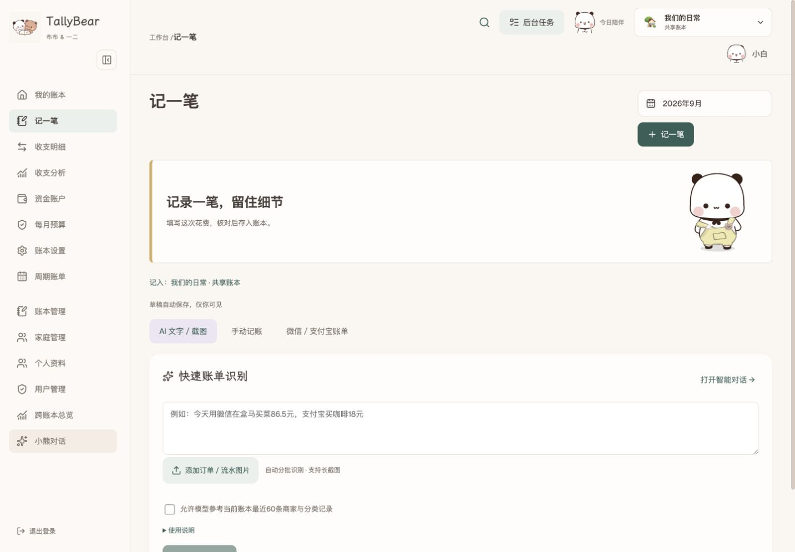
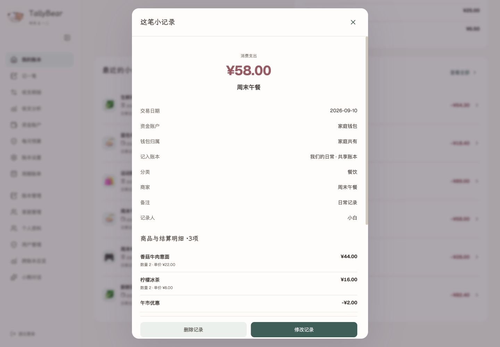

<div align="center">


# TallyBear

**让 AI 读懂账单，让每一笔生活清晰可见。**

带有 **布布一二（一二布布）小熊主题**的 AI 个人与家庭记账应用。
自主部署 · 对话记账 · 家庭资金往来 · 布布一二陪伴

[English](README.md) · 简体中文

[](https://github.com/JYao-Chen/TallyBear/releases/tag/v1.5.0)
[](LICENSE)
[](docs/deployment.md)

[开始使用](#开始使用) · [探索功能](#从一张账单到一份洞察) · [部署指南](docs/deployment.md) · [版本下载](https://github.com/JYao-Chen/TallyBear/releases)

</div>

统一财务记忆支持有原文依据的商品属性提炼（包括只有标题的旧手工账单）、逐字段填充／撤回和偏好冲突处理。默认复用通义千问密钥，使用 `text-embedding-v4` 与 `qwen3.8-flash`；按用户调整后的要求，5 个真实模型案例已通过。详见[财务记忆、历史初始化与验收说明](docs/financial-memory.md)，小样本通过不代表总体准确率。

**和布布、一二一起记账。** 白熊与棕熊插画、动态表情包和可自定义的分类图标，让日常记账多一点可爱。可以选择布布一二主题，也可以切换为简洁的无小熊界面。


## 当前主分支

当前版本在 1.5 的基础上，进一步分清了**账本归类**和**本人真实资金流动**：

- **收支分析**已经合并图表与明细。日期、类型、钱包、分类和关键词筛选会同时更新汇总、图表与分页列表；切换到“我的个人钱包”后，会跨全部账本汇总本人持有的钱包。
- **活动账**可以把旅行、聚会等活动在不同账本中的交易归集查看，而不重复扣款。活动可自定义类型、日期和预算，可设为个人活动或关联一个家庭；家庭成员可共同记账，但每个人只看到自己原本有权访问的账本交易，因此成员之间的可见合计可能不同。首页可直接选择活跃活动记一笔；手动记账、识图草稿、助手确认卡和已有交易也能选择活动。活动支持名称／类型／家庭搜索筛选、专门的归档视图、重新启用和删除；删除活动只移除归集关系，不删除原账目。活动页提供分类／钱包／账本构成、每日支出及分页明细；全局搜索和 AI 助手也可查询活动。
- **资金资产**新增余额分布、每日收支和消费分类图表，可随“我的资产／家庭资产”范围切换，同时保留钱包收支表格。
- **个人分类库**改为跟随用户账号，在全部个人／共享账本中使用同一套分类。升级时会自动合并本人各账本的现有分类，其他成员修改分类不会影响你。
- **个人分类习惯自学习**同时用于智能识图和 AI 确认卡片。系统在服务端按路线、商家、商品和场景匹配本人确认记录、常用预设与修正，加入时间衰减和置信度门槛；用户明确选择的分类永不被覆盖。
- 草稿卡片会显示分类依据、匹配度和参考的个人记录数量；保存前修改分类，会形成更高权重的纠正证据。
- 账单识别和 AI 助手拥有**各自独立的文字／视觉模型配置**；助手内部图片理解及嵌套调用都统一使用助手配置。
- 识别到明确扣款依据时可预选唯一的本人钱包；仅识别出微信或支付宝时，也只有唯一匹配钱包才会自动选择，多个候选仍留给用户核对。
- 持续增长的列表统一分页。手机端导航可直接退出登录；活动页的操作按钮在窄屏与横屏下保持可读、可点。

[查看当前主分支全部变化 →](CHANGELOG.md#unreleased--current-main) · [个人分类学习机制 →](docs/category-learning.md)

## 最新正式标签：1.5

**从识图记账，走向能交互完成操作的 AI 家庭财务助手。**

可编辑 AI 确认卡片 · 收款方自主选择私人钱包 · 个人账本往来展示 · 分期与精确费用分摊 · 自选分析范围与图表下钻 · 重新设计的电脑／手机对话体验。

[查看 1.5 发布说明 →](docs/releases/v1.5.0.md) · [现有部署升级 →](docs/deployment.md#upgrading-to-150)

## 从一张账单，到一份洞察

拍下小票，整理明细；记下日常，读懂收支。

<table>
<tr>
<td width="33%" align="center">
<br/>
<strong>01 · 轻松录入</strong><br/>
截图变成可编辑账单。<br/>商家、商品、优惠，一起留下。
</td>
<td width="33%" align="center">
<br/>
<strong>02 · 智能核对</strong><br/>
核对金额，发现重复。<br/>跨图归并，还原完整订单。
</td>
<td width="33%" align="center">
<br/>
<strong>03 · 对话分析</strong><br/>
问问收支，生成图表。<br/>把有用的分析保存成报告。
</td>
</tr>
</table>

### 拍照、说一句，或点选常用一笔

一次上传多张小票、订单截图或长截图，AI 区分多笔订单与同一订单的跨图内容，生成可编辑草稿。也可以手动填写，或选择预设快速记录固定通勤、日常消费与收入。

| 记账细节 | 如何处理 |
|---|---|
| 商家与商品 | 店名作为主标题；长商品名提炼为简洁摘要，每个商品保留独立明细。 |
| 商品与结算 | 数量、单价、小计、结算优惠、抹零和附加费用分别记录，整单以实际支付金额为准。 |
| 不完整截图 | 区分“截图未展示完整结算”和金额矛盾；可确认实付并保留差额说明，不凭差额编造优惠。 |
| 重复与退款 | 比对已有记录、提示疑似重复；全额或部分退款关联原消费，到账后冲减支出。 |
| 时间与备注 | 记录交易时间、创建时间和修改时间；缺失交易时间时使用设备时间补齐。备注聚焦用途等有价值信息。 |
| 图片与搜索 | 可选保存压缩凭证、附加生活照片；按商家、类别、金额、日期和商品子项目查找账目。 |

交通、餐饮、购物、买菜使用统一的场景字段：公交或地铁的起终点、商家与门店、用餐类型、商品概括分别填写。AI、手动表单与常用预设共用这些字段，已指定的标题可以直接修改。

手动记账和识图草稿可选填**订单号**、**交易／退款流水号**；截图清晰可见时可自动提取，方便以后查重和对账。在 **收支分析 → 智能核对账单** 打开助手预填问题后，仍需自行附上支付账单截图并发送。助手先比对编号和精确时间，再结合交易先后顺序、相邻关系提示可能漏记或重复；不会因名称、金额相同就直接认定为同一笔，也不会未经确认自动改账。

开启“使用我的分类习惯”后，系统只在服务端读取当前用户本人确认过的记录、常用预设与分类修正，按交通路线、商家、商品内容和场景进行确定性匹配。修正权重更高，旧证据会随时间衰减；证据不足或互相冲突时保留识别模型原分类，用户明确选择的分类不会被覆盖。个人历史不会发送给模型。草稿会显示匹配依据、匹配度与证据数量，修改后保存会成为下一次优先参考的纠正。

### AI 不只分析，也能把事情办到确认前

> “刚坐公交从朝阳公园枢纽到中关村一街，两块钱，用微信付的。”
>
> “这笔年付订阅帮我记下来，并设置费用分摊。”
>
> “给一二转了 1500 元房租，从我的微信出，帮我登记家庭往来。”

助手查询真实账本、分类、钱包和家庭成员，调用工具准备**可编辑确认卡片**。缺少或存在歧义的信息留给你补充；可以继续对话，也可以直接在卡片中改钱包、类别、金额、场景与商品明细，点击确认后保存。

| 在对话中完成 | 支持的操作 |
|---|---|
| 日常记账 | 支出、收入、退款、转账与商品明细；修改或删除已入账交易须经确认 |
| 经常发生的事 | 常用一笔、周期订阅、分类预算 |
| 大额或跨期费用 | 费用分摊、分期购买、实际还款 |
| 家庭资金往来 | 转账、红包、AA 分担与结算、借还款、共同钱包入金、收款确认 |
| 财务分析 | 指定账本范围、查询流水与资产、生成交互图表、保存报告 |

确认卡片跟随对应的对话轮次。历史对话和报告可以删除；输入框随内容扩展，图片上传与选项整合在输入区，电脑和手机都可以直接操作。

识图同时辨认**订单平台、支付渠道和实际扣款依据**：即使没有应用名称，也可结合 Logo 与页面布局识别微信、支付宝、京东、抖音等来源。明确的零钱、银行及尾号信息用于匹配本人钱包；多个候选留在确认卡片中选择，页面来源不会直接当作扣款账户。

### 个人资产、家庭资产与账本，各司其职

**钱包回答“钱在哪里”，账本回答“这笔钱按什么范围统计”。**

- 账户独立归属个人或家庭。多个微信、支付宝、银行卡分别管理，显示对应标识与银行 Logo。
- 独立账号可加入家庭；一个家庭可以有多个账本。用户、家庭和账本各有管理页面、头像与权限。
- 个人钱包可以支付共享账本的消费。移动账目时保留原付款账户；复用到多个账本时，跨账本汇总按同一事件去重。
- 个人分类可增删改、调整顺序和设置图标，并在全部账本通用；账目支持批量整理、移动与关联复用。

在 **收支分析 → 我的个人钱包** 中，可以通过本人持有的钱包查看跨全部账本的实际收入、支出、退款与转账；上方图表与下方可搜索、分页的明细共用同一组筛选条件，不再需要单独的“收支明细”或跨账本总览入口。该范围排除家庭共同钱包与其他成员钱包，转账不计收入或支出，同一关联事件出现在多本账本时只计算一次。进入 **资金资产** 后，还可以在本人钱包和家庭共同钱包之间切换相应的资产与收支图表。

### 旅行或活动统一统计，不用再建一本账

进入 **活动账**，为旅行、聚会等活动填写名称、可搜索的类型，以及可选的日期和预算。活动可以只属于自己，也可以挂在一个家庭下；家庭成员可从自己有权编辑的账本参与记账。活动只是跨账本的归集标签，原交易仍留在原账本、原钱包，不会再次扣款。每位成员只能统计自己原本有权访问的账本交易，所以家庭成员看到的活动合计可能不同。

首页的 **进行中的活动 → 记一笔到活动** 可直接进入记账；手动记账、识图草稿或活动页的 **加入已有交易** 也能指定活动。助手可以查找活动，并准备带活动归属的交易确认卡；它不会自行创建、归档或删除活动。活动详情提供分类、付款钱包、账本与每日支出图表，以及可搜索、筛选和分页的交易明细。

活动列表可按名称、类型、家庭和说明搜索，并按类型、归属筛选。**归档活动** 独立查看，归档后不能加入新交易，重新启用后可继续记账；可管理活动的人也能删除活动。删除只解除活动归集，不删除任何原账目。手机端的记账、编辑、归档、重新启用、删除与确认按钮在窄屏及横屏下均保持完整可点。

### 家庭转账，两个人各记各的视角

付款方选择**自己的转出钱包和收款成员**；收款方确认到账时选择**自己的到账钱包**。双方看不到对方的私人钱包。共同钱包则由有权限的家庭成员管理。

双方还可以分别选择自己的个人展示账本，并记住默认选择。在个人账本的**首页**与**收支分析内的明细列表**中统一查看记录和到账状态；首页的**待收款**可直接选择自己的到账钱包和账本确认；修改展示位置不影响余额或对方的记录。已有往来可以补选展示账本。

| 房租 AA 示例 | 记录位置 | 是否计入家庭支出 |
|---|---|---|
| 一二转给布布 1500 元 | 家庭往来；双方各自选择的个人账本 | 否 |
| 布布向房东支付 3000 元 | 付款时选择的共享账本 | 3000 元 |
| 两人各向共同小荷包转入 500 元 | 家庭往来；各自的展示账本 | 否 |

红包、借款、部分还款、AA 结算和共同入金使用同一套往来机制。AA 关联原消费及承担份额，借款关联后续还款；重复流水与相似转账会提示核对。同一笔往来保留一个底层记录，双方确认后同步余额，红包赠与计入付款人的个人支出、收款人的个人收入；家庭合并统计时抵消内部收支。普通资金调拨、借还款、AA 结算和共同入金不计消费。

### 订阅、分期与分摊，分清三个问题

| 功能 | 管什么 | 对账目的影响 |
|---|---|---|
| 周期账单 | 下次何时支付 | 自定义日、周、月、年及间隔，到期核对实际付款。 |
| 分期与负债 | 还欠多少、还了多少 | 购买时记消费；还本金是转账，利息与手续费另计支出。 |
| 费用分摊 | 已付款的成本覆盖多久 | 按选定周期分配成本，保留金额尾差，不重复扣款。 |

支持白条、花呗、信用卡等负债账户，关联新购买或已有消费，登记部分还款、提前结清、调整后续各期以及撤销误记还款。费用分摊独立于还款计划，提前结清不会自动缩短使用期；退回负债账户的退款会抵减本金。

### 从一张图，继续看到每一笔

在对话输入区选择**当前账本、多个账本或全部可访问账本**。跨账本汇总会去重关联记录，资产查询则按个人／家庭钱包归属统计，避免把统计范围不同误判为漏记。

图表提供多色分类、环形／柱形／趋势等视图；带有查询维度的图表可以点击分类或时间点，继续查看相关账单明细。分析可保存为报告，之后重新打开查看。

识图和对话由后台队列持续处理，支持进度、流式回答、重试及管理员调整并发。离开网页后任务继续运行，回来再查看结果。

## 让日常记账，多一点陪伴

选择布布一二主题，让柔和配色与 **564 张动态表情**陪你记账；也可以切换简洁主题。头像、分类和账本标识，都能从表情库中挑选。

<p align="center"> &nbsp; </p>

<table>
<tr>
<td width="50%" align="center"><strong>手机随手记</strong><br/><br/></td>
<td width="50%" align="center"><strong>明细与优惠，一目了然</strong><br/><br/></td>
</tr>
</table>

<details>
<summary><strong>展开查看更多中文页面</strong></summary>

#### 智能录入


#### 订单详情


</details>

## 技术路线与 AI 协作

TallyBear 使用 **Next.js 全栈应用 + PostgreSQL + 独立任务 Worker**。前端与 API 共享 TypeScript 领域类型；交易、权限、任务进度和报告持久化到数据库，图片经 Sharp 压缩后进入独立存储。

| 层次 | 实现 | 负责什么 |
|---|---|---|
| 页面与交互 | React · Next.js App Router | 响应式记账、草稿核对、对话与账本管理 |
| 业务与数据 | Next.js API · PostgreSQL | 账本权限、交易事务、账户余额、个人分类学习、费用分摊与去重统计 |
| AI 协作 | LangGraph · 工具调用 | 总助手按任务委派识别、核对、分析助手 |
| 后台执行 | 独立 Node.js Worker · PostgreSQL 队列 | 持久任务、进度、重试与可配置并发 |
| 展示与附件 | Recharts · Markdown · Sharp | 对话图表、可保存报告、高清压缩凭证 |

### 总助手调度，专业助手分工

对话采用 **Supervisor + 专业助手** 的多智能体架构。每个助手通过 LangGraph 的“模型决策 → 工具执行 → 继续决策”循环完成任务。总助手可以直接回答简单问题，也可以根据需要委派专业助手，再依据返回的证据继续调用工具或汇总结论。

| 助手 | 使用的能力 | 用户得到的结果 |
|---|---|---|
| 总助手 | 理解问题、选择工具、委派任务、汇总结果 | 一个连续的财务对话入口 |
| 记账与计划助手 | 准备账单、订阅、预算、分期与家庭往来卡片 | 在对话中补齐表单，确认后保存 |
| 识别助手 | 图片与文字识别、跨图订单整理 | 商家标题、商品明细、优惠和可编辑草稿 |
| 核对助手 | 草稿检查、重复匹配、退款与金额核验 | 可核对的差额、重复提示与关联建议 |
| 分析助手 | 收支查询、账户查询、预算与分摊、图表工具 | 有数据依据的分析、图表与报告 |

**AI 理解内容，业务工具计算金额并执行权限校验。** 图表工具直接查询账本汇总，金额采用整数最小货币单位计算；模型负责解释结果、选择分析范围与组织报告。账单识别结合结构化提取和金额核验，把图片转换成可确认的记录。

专业助手共享本轮草稿与已有结论，通过总助手协调协作。后台队列支持多个任务并发执行；对话中展示处理阶段、工具活动和流式回答，用户离开页面后任务继续运行。账单识别与 AI 助手分别配置服务地址、API Key、文字模型和视觉模型：助手的文字、附件图片及内部嵌套调用统一走助手配置，账单 OCR 与复核走识别配置；队列并发为共用设置。

卡片在用户确认前保持草稿状态。确认时由业务代码在数据库事务中重新校验权限与当前数据；家庭往来保留单一记录，通过双方独立的展示关联进入个人账本。队列进度和对话产物持久化到 PostgreSQL，浏览器关闭后仍由 Worker 继续处理。

这条路线把 **录入 → 核对 → 确认 → 入账 → 分析** 连起来：减少逐项抄写，让重复订单与金额差异在确认前可见，并把财务查询直接变成可查看、可保存的图文结果。

## 开始使用

准备 **Docker Compose v2** 与 **Node.js 22**（用于初始化配置）。

```sh
git clone https://github.com/JYao-Chen/TallyBear.git
cd TallyBear
npm run setup
```

以上安装当前 `main`，包含本文“当前主分支”列出的功能；如需最新正式标签，在克隆命令中加入 `--branch v1.5.0`。

打开生成的 `.env`，设置语言、币种与访问地址：

```dotenv
APP_ORIGIN=http://localhost:3016
APP_LANGUAGE=zh-CN
APP_CURRENCY=CNY
```

```sh
docker compose up -d --build
```

打开 [**localhost:3016**](http://localhost:3016)，使用 `.env` 中的 `ADMIN_USERNAME` 与自动生成的 `ADMIN_PASSWORD` 登录，创建第一本账本即可开始记录。

<details>
<summary><strong>语言、币种与公网部署</strong></summary>

| 配置 | 可选值 |
|---|---|
| `APP_LANGUAGE` | `en` · `zh-CN` |
| `APP_CURRENCY` | `USD` · `EUR` · `GBP` · `CNY` |

初始化默认使用英文与美元。每套部署统一使用一种语言和币种，界面、AI 生成摘要、图表与导出遵循语言设置；金额以最小货币单位的整数存储。人民币部署还支持微信与支付宝 CSV 账单导入。

公网访问时配置 HTTPS 反向代理，并将 `APP_ORIGIN` 设为实际公网地址。

[部署、存储与备份 →](docs/deployment.md)

</details>

<details>
<summary><strong>连接 AI 服务</strong></summary>

1. 管理员打开 **账本设置**。
2. 在 **账单识别模型** 中填写 OpenAI 兼容服务地址、API Key、文字与视觉模型名称。
3. 单独配置 **AI 助手模型**；助手文字模型需要支持工具调用与流式输出，视觉模型需要支持图片输入。
4. 分别对两套配置运行文字／图片连接测试，再设置共用的后台并发数量。
5. 进入 **记一笔 → AI 文字／截图**，上传账单，核对草稿并选择资金账户。

[记账与 AI 使用指南 →](docs/user-guide.md)

</details>

<details>
<summary><strong>参与开发</strong></summary>

**Next.js App Router · React · TypeScript · PostgreSQL · LangGraph · Recharts · Sharp**

Next.js 提供页面与 API，独立 Worker 处理持久化后台任务，与 Web 应用共享 PostgreSQL 和图片存储。

```sh
npm ci
npm run setup
docker compose -f compose.yaml -f compose.dev.yaml up -d db
node --env-file=.env scripts/init.mjs
npm run dev
```

在另一个终端启动 Worker：

```sh
node --env-file=.env --import tsx scripts/worker.ts
```

```sh
npm run typecheck
npm test
npm run build
```

[贡献指南 →](CONTRIBUTING.md)

</details>

---

<div align="center">

**一起把记账，做成更轻松的小事。**

欢迎分享使用建议、完善翻译、补充账单格式，或提交你的改进。

[提出建议](https://github.com/JYao-Chen/TallyBear/issues) · [参与贡献](CONTRIBUTING.md) · [更新记录](CHANGELOG.md)

喜欢 TallyBear？点一颗 ⭐，让更多人找到自己的记账伙伴。

[MIT](LICENSE) · [素材与致谢](THIRD_PARTY_NOTICES.md)

</div>

### 同款复购、退款与跨账本搜索

“记一笔 → 手动记账”可通过统一全局搜索选择退款原单；复购无需额外入口，由 AI 识别和助手自动匹配关联。默认搜索全部可访问账本，支持多关键词、日期／金额筛选和分页；选择后自动填充可复用信息，仍可调整。图片／文字识别和助手使用已确认的个人历史匹配同款，保留本次价格、时间和订单编号；外卖以菜品为标题，堂食以店名为标题。退款／返现支持多次累计并可超过原支付，净支出允许为负。同款记录可在全局搜索中查看汇总，不会把真实复购合并成一笔。详见 [用户指南](docs/user-guide.md#repeat-purchases--复购记忆)。
