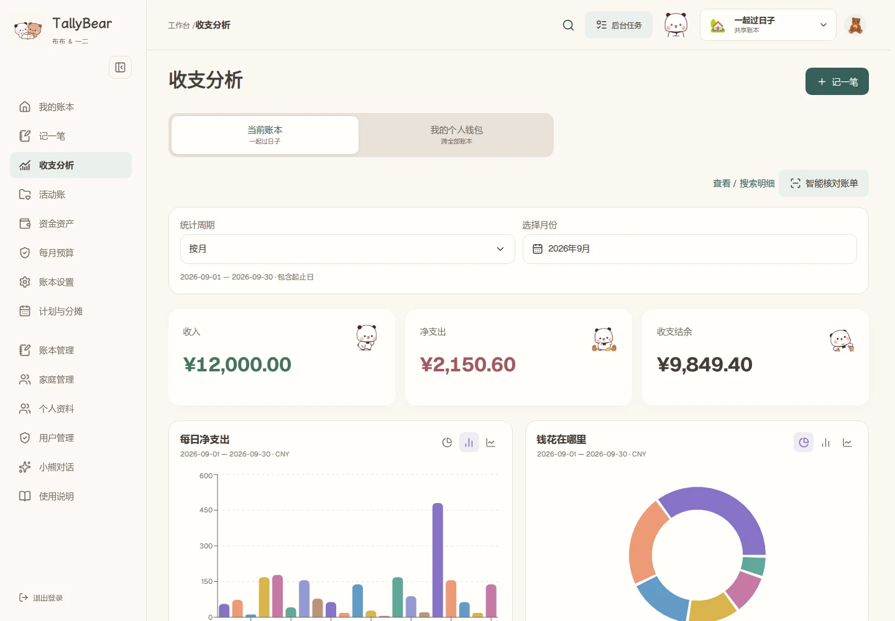
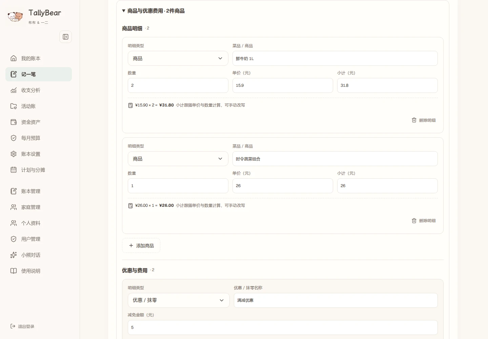
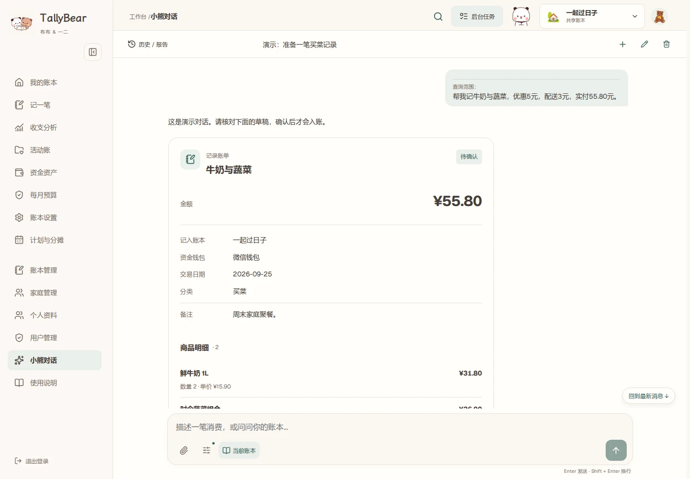
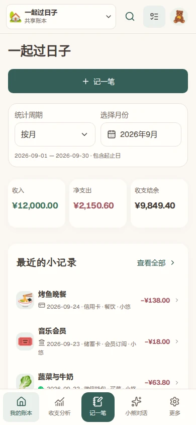
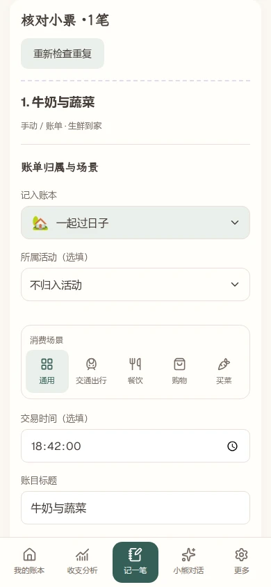

<div align="center">


# TallyBear

**个人与家庭记账，支持 AI 录入、财务记忆和跨账本活动。**

自主部署 · 多账本 · 独立钱包 · 家庭协作 · 中文 / English

[English](README.md) · 简体中文

[](CHANGELOG.md)
[](LICENSE)

[功能介绍](#能做什么) · [电脑与手机截图](#电脑与手机截图) · [开始使用](#开始使用) · [文档](#文档)

</div>

TallyBear 把日常账单、钱包收支和家庭开销放在同一个工作台。可以手动记账、导入账单，也可以上传截图或直接告诉助手；核对草稿后再入账。账本负责整理记录，钱包负责记录钱的实际去向，两者分别统计。

目前版本为 **2.0**，整合了财务记忆、跨账本活动、图表与明细联动、对话管理，以及重新排版的记账卡片。界面提供布布一二小熊主题，也可切换为极简主题。



## 能做什么

### 记下一笔，也保留商品与结算细节

- **多种录入方式。** 手动输入、AI 文字／截图识别，以及微信／支付宝账单文件导入。草稿会保存，切换页面后可继续核对。
- **长截图与多图订单。** 先分段识别，再结合订单信息核对归属；有明确依据的商品段和结算段可归并为一单，模糊结果保留待确认。
- **商品与优惠费用分开。** 商品有数量、单价和小计；满减或优惠券单独减去，配送、包装和手续费单独加上，不混进商品列表。
- **明细计算器。** 输入单价与数量后推荐小计；小计仍跟随计算时，修改数量会同步更新。已识别或手动改写的小计保留不变。整单推荐实付需要主动点击采用，之后仍可修改。
- **规范的日期与付款信息。** 交易日期采用 `YYYY-MM-DD`，缺失时使用记录当天；时分秒单独保存，未知可留空。订单号及支付／退款流水号可识别、选填和搜索。
- **关联退款与返现。** 跨账本搜索原消费，选择后带入已知信息，再填写到账金额。支持多次退款，累计金额可以大于原消费，统计保留负净支出。



### 分清账本、钱包、活动与分类

| 概念 | 回答的问题 | 例子 |
|---|---|---|
| 账本 | 记录放在哪里，谁可以查看？ | 个人账本、家庭共享账本 |
| 钱包 | 钱从哪里支出，或收入到哪里？ | 微信余额、银行卡、现金、信用账户 |
| 活动 | 这笔钱属于哪次旅行、聚会或项目？ | 一次周末旅行，包含不同账本里的消费 |
| 分类 | 钱具体花在什么用途？ | 餐饮、交通、买菜、会员订阅 |

“个人钱包”统计汇总本人钱包在不同账本里的实际收支。把同一笔付款关联到另一个账本，不会因此再次扣款；活动也只关联已有交易。

活动支持自定义类型、起止日期和预算，可设为个人活动或挂到家庭。归档后进入单独列表，之后可恢复活跃；删除活动只移除关联，不删除账单。家庭成员参与活动不会获得原本无权查看的私人账本权限。

### 从图表看到每笔明细

**收支分析**在同一页面提供图表、搜索与分页明细。支持年、月、周、日和自定义区间，按分类或钱包进一步筛选；点击图表可查看对应账单及完整详情。

**资金资产**展示钱包余额分布和收支趋势，可切换个人与家庭资产范围。余额校正会留下调整记录；需要查清漏记或重复时，可上传支付账单交给助手智能核对，再决定如何处理。

**每月预算**仍以月份为单位。周期扣款、分期购买、还款和费用分摊集中在“计划与分摊”管理。还款本金与转账不当作新的消费，利息和手续费需单独按实际用途记账。

### 助手准备操作，你确认执行

助手可以查询可访问账本、解释统计结果、核对账单，并准备修改卡片。已接入的操作覆盖账目与退款、钱包管理、活动、分类、预算、计划、家庭和记忆。

消息发送后即保存，对话范围也一并保留。切换页面后，后台任务仍继续处理。卡片按金额、商品、优惠费用、缺失信息和核对提示分区；普通处理说明与账单备注分开。“更新卡片”和“确认入账”是两个步骤，编辑不会直接改动账目。

助手与页面使用相同的业务接口和权限检查。密码、新密钥及文件上传仍在专门页面完成，不开放任意数据库或服务器操作。支持范围见[助手能力说明](docs/assistant-capability-audit.md)。



### 已确认的信息，下次少填一点

在 **个人资料 → 记忆中心** 管理商品与服务、记账偏好、对话记忆和待确认建议。可以查看来源，修改别名，处理冲突，也可停用、合并、拆分、导出或遗忘。

通过 AI 记账时，系统自动检索相关记忆，逐字段给出填充建议，无需另点“再买一笔”。同款可以复用商品身份，但新价格、数量、交易日期、付款编号和钱包不会直接从旧单复制成新事实。

检索结合精确／关键词候选、语义向量与模型判别，不需要微调模型或另建向量服务。安装 pgvector 后，PostgreSQL 可执行向量距离查询；模型或扩展不可用时退回关键词建议。

个人记忆默认私有，分享需要明确确认。遗忘记忆不会删除原账单。[记忆系统实现与边界 →](docs/financial-memory.md)

### 家庭协作，保留个人边界

创建家庭与共享账本，分别设置成员权限。在 **记一笔 → 家庭往来** 管理转账、赠与、AA 结算、借还款和共同资金；收款人选择自己的到账钱包，家庭资金流转与日常消费分开统计。

分类跟随用户账户，在个人和共享账本间通用，其他成员的分类调整不会覆盖你的设置。全局搜索覆盖可访问账本，能查账单、商品明细、订单编号，以及活动、计划、报告和记忆。

## 电脑与手机截图

应用内的**使用说明**分为 18 章，从项目介绍和首次设置，到日常记账、资产管理与助手答疑。每章提供分步操作、示例、注意事项和对应截图，可直接打开相关功能，也可把章节主题带给助手继续提问。中文页面使用中文截图，英文页面使用英文截图；电脑与手机视图可切换。输入关键词或问题，可通过关键词与语义检索查找章节，命中文字会高亮；助手也能查阅说明并提供章节入口。说明书索引复用记忆嵌入模型，未配置或暂不可用时保留关键词搜索。[说明书检索实现](docs/help-manual.md)

手机端首页与草稿核对：

<table>
<tr><th>首页</th><th>草稿核对</th></tr>
<tr>
<td></td>
<td></td>
</tr>
</table>

[查看全部中文截图](docs/screenshots/README.zh-CN.md)，包括电脑与手机上的资产、活动、家庭往来、记忆和搜索等功能。

语言与币种由部署配置决定，没有用户级切换器。支持人民币、美元、欧元和英镑；同一数据库使用一种币种，修改环境变量不会换算已有金额。

## 开始使用

需要 **Node.js 22** 运行配置助手，以及 **Docker Engine / Docker Compose v2**。只有使用 AI 功能时才需要模型服务。

```sh
git clone https://github.com/JYao-Chen/TallyBear.git
cd TallyBear
npm run setup
```

首次启动前，编辑生成的 `.env`：

```dotenv
APP_ORIGIN=http://localhost:3016
APP_LANGUAGE=zh-CN
APP_CURRENCY=CNY
```

保留自动生成的密码与加密密钥。配置助手默认生成英文／美元环境，需要中文时按上面修改。

```sh
docker compose up -d --build
docker compose ps
curl --fail http://localhost:3016/api/health
```

打开 **http://localhost:3016**，使用私有 `.env` 中的 `ADMIN_USERNAME` 和 `ADMIN_PASSWORD` 登录。创建账本与钱包，核对期初余额，即可开始记账。需要 AI 时，再到 **账本设置** 配置模型。

Compose 包含 PostgreSQL、一次性初始化程序、Web 服务和后台 worker；两个运行进程共用持久凭证目录。不配置 AI 密钥也能手动记账。默认 PostgreSQL 镜像不含 pgvector，需另行安装与数据库主版本匹配的扩展，才能启用记忆向量检索。

### 模型与后台任务

| 配置入口／用途 | 处理范围 |
|---|---|
| 识图文字／图片模型 | 快速文字录入、截图与小票识别 |
| 助手文字／图片模型 | 对话、工具调用，以及助手中上传的图片 |
| 记忆嵌入模型 | 语义检索 |
| 记忆提炼／候选判别模型 | 提取商品属性与偏好，比较候选商品 |

识图与助手分别配置。记忆模型可复用现有的**官方通义千问**密钥，默认嵌入为 `text-embedding-v4`（1024 维），提炼和判别为 `qwen3.8-flash`；三个用途仍可独立设置。模型能否使用及费用，以所配置服务商账户为准。

密钥通过 `ENCRYPTION_KEY` 加密保存，备份时必须保留该配置。使用外部模型会把当前任务所需内容发送给服务商，自主部署不等于模型在本地运行。

### 从旧版升级

1. 一起备份数据库、收据文件与环境配置。
2. 保留原 PostgreSQL 主版本、数据卷、加密密钥、语言和币种。
3. 停止 Web 与 worker，更新到目标代码版本后重新构建；初始化会依次执行两份 schema 脚本。
4. 一起启动 Web 与 worker，检查 `/api/health`，确认旧账单和附件可用。
5. 按需配置记忆模型与 pgvector；历史记忆整理需要单独启动后台任务。

不要为了升级新建生产数据卷，也不要执行 `docker compose down -v`。回退代码不会撤销数据库变化。完整步骤见[部署与备份说明](docs/deployment.md)。

## 本地开发

技术栈为 Next.js App Router、React、TypeScript、PostgreSQL、Recharts、LangGraph，以及 OpenAI 兼容模型接口。

```sh
npm ci
# 先准备独立开发数据库与 .env，不复用生产环境。
node --env-file=.env scripts/init.mjs
npm run dev
# 另开终端启动后台任务：
node --env-file=.env --import tsx scripts/worker.ts
```

```sh
npm test
npm run typecheck
npm run build
```

构建会在 `.next/standalone` 生成 `server.js` 与 `worker.mjs`。发布时补齐 `public` 和 `.next/static`，并给两个进程传入相同环境。源码发布、持久文件、密钥和备份分别管理。

截图更新方法见[截图维护](docs/screenshot-maintenance.md)。

## 使用边界

- AI 可能漏识别或误判，保存前仍需核对订单、日期、实际钱包和金额。不确定的账单匹配不应直接合并。
- 全局搜索和明细搜索采用关键词及字段筛选；向量检索用于记忆，不是全站语义搜索。
- 尚未提供商品价格趋势图，也不自动进行汇率换算。
- 支持浏览器与 PWA，不代表支持完整离线记账。手机震动反馈取决于设备和浏览器能力。

## 文档

- [使用说明](docs/user-guide.md)：录入、退款、活动、统计与助手操作。
- [部署指南](docs/deployment.md)：安装升级、持久存储、备份恢复。
- [财务记忆](docs/financial-memory.md)：来源、检索、分享、遗忘与模型配置。
- [分类学习](docs/category-learning.md)：现有的分类反馈算法。
- [助手能力](docs/assistant-capability-audit.md)：支持的操作和确认边界。
- [语言与币种](docs/internationalization.md)。
- [版本历史](docs/version-history.zh-CN.md)：各版本的主要迭代。
- [2.0 版本说明](docs/releases/v2.0.0.md) · [变更记录](CHANGELOG.md)。

## 许可与素材

应用代码采用 [MIT 许可](LICENSE)。可选的布布一二角色素材、字体和支付标识仍归各自权利方；TallyBear 并非角色官方产品，代码许可不包含角色素材的统一授权。详见[第三方素材声明](THIRD_PARTY_NOTICES.md)。
