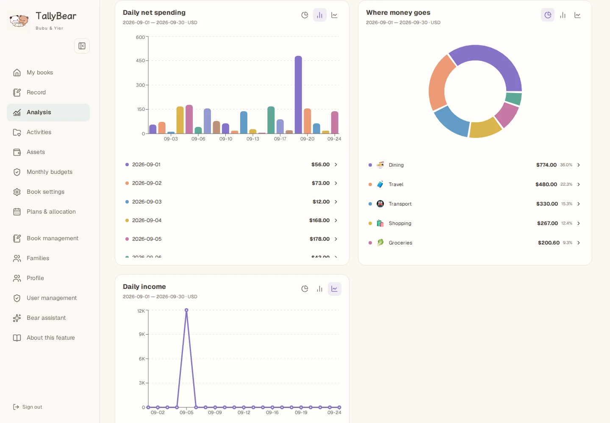

# TallyBear screenshot gallery

English · [简体中文](README.zh-CN.md)

Current version: **2.0**. Explore each feature on desktop and mobile.

| Feature | Desktop | Mobile |
|---|---|---|
| Overview | [View](v2/en-desktop-overview.webp) | [View](v2/en-mobile-overview.webp) |
| Spending analysis | [View](v2/en-desktop-analysis.webp) | [View](v2/en-mobile-analysis.webp) |
| Charts | [View](v2/en-desktop-charts.webp) | [View](v2/en-mobile-charts.webp) |
| Assets | [View](v2/en-desktop-assets.webp) | [View](v2/en-mobile-assets.webp) |
| Activities | [View](v2/en-desktop-activities.webp) | [View](v2/en-mobile-activities.webp) |
| Monthly budgets | [View](v2/en-desktop-budgets.webp) | [View](v2/en-mobile-budgets.webp) |
| Books | [View](v2/en-desktop-books.webp) | [View](v2/en-mobile-books.webp) |
| Family | [View](v2/en-desktop-family.webp) | [View](v2/en-mobile-family.webp) |
| Categories | [View](v2/en-desktop-categories.webp) | [View](v2/en-mobile-categories.webp) |
| Help | [View](v2/en-desktop-help.webp) | [View](v2/en-mobile-help.webp) |
| Recurring plans | [View](v2/en-desktop-plans.webp) | [View](v2/en-mobile-plans.webp) |
| Profile | [View](v2/en-desktop-profile.webp) | [View](v2/en-mobile-profile.webp) |
| Memory center | [View](v2/en-desktop-memory.webp) | [View](v2/en-mobile-memory.webp) |
| Memory history | [View](v2/en-desktop-memory-history.webp) | [View](v2/en-mobile-memory-history.webp) |
| Manual entry | [View](v2/en-desktop-manual.webp) | [View](v2/en-mobile-manual.webp) |
| Linked refund | [View](v2/en-desktop-refund.webp) | [View](v2/en-mobile-refund.webp) |
| Statement import | [View](v2/en-desktop-import.webp) | [View](v2/en-mobile-import.webp) |
| Reconciliation input | [View](v2/en-desktop-reconcile.webp) | [View](v2/en-mobile-reconcile.webp) |
| AI entry | [View](v2/en-desktop-intake.webp) | [View](v2/en-mobile-intake.webp) |
| Draft review | [View](v2/en-desktop-draft.webp) | [View](v2/en-mobile-draft.webp) |
| Item calculator | [View](v2/en-desktop-line-items.webp) | [View](v2/en-mobile-line-items.webp) |
| Family movements | [View](v2/en-desktop-family-entry.webp) | [View](v2/en-mobile-family-entry.webp) |
| Assistant confirmation | [View](v2/en-desktop-assistant.webp) | [View](v2/en-mobile-assistant.webp) |
| Cross-book search | [View](v2/en-desktop-search.webp) | [View](v2/en-mobile-search.webp) |

## Spending analysis

## Record on the go

 

[Back to TallyBear](../../README.md)
