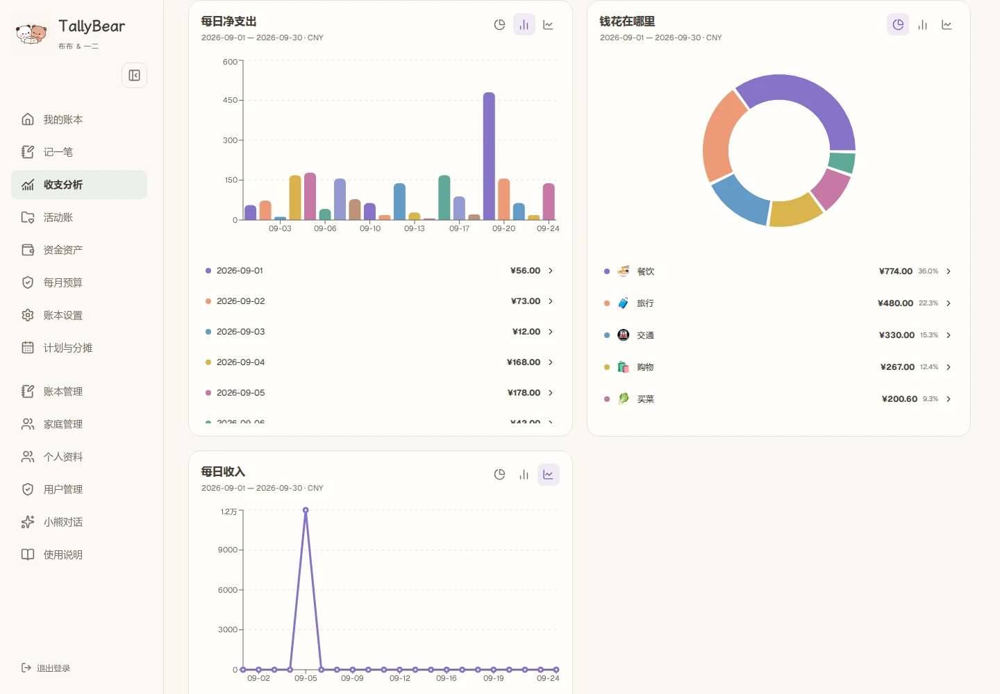

# TallyBear 截图画廊

[English](README.md) · 简体中文

当前版本：**2.0**。查看各功能的电脑端与手机端界面。

| 功能 | 电脑端 | 手机端 |
|---|---|---|
| 首页 | [查看](v2/zh-desktop-overview.webp) | [查看](v2/zh-mobile-overview.webp) |
| 收支分析 | [查看](v2/zh-desktop-analysis.webp) | [查看](v2/zh-mobile-analysis.webp) |
| 统计图表 | [查看](v2/zh-desktop-charts.webp) | [查看](v2/zh-mobile-charts.webp) |
| 资金资产 | [查看](v2/zh-desktop-assets.webp) | [查看](v2/zh-mobile-assets.webp) |
| 活动账 | [查看](v2/zh-desktop-activities.webp) | [查看](v2/zh-mobile-activities.webp) |
| 每月预算 | [查看](v2/zh-desktop-budgets.webp) | [查看](v2/zh-mobile-budgets.webp) |
| 账本管理 | [查看](v2/zh-desktop-books.webp) | [查看](v2/zh-mobile-books.webp) |
| 家庭管理 | [查看](v2/zh-desktop-family.webp) | [查看](v2/zh-mobile-family.webp) |
| 个人分类 | [查看](v2/zh-desktop-categories.webp) | [查看](v2/zh-mobile-categories.webp) |
| 使用说明 | [查看](v2/zh-desktop-help.webp) | [查看](v2/zh-mobile-help.webp) |
| 周期计划 | [查看](v2/zh-desktop-plans.webp) | [查看](v2/zh-mobile-plans.webp) |
| 个人资料 | [查看](v2/zh-desktop-profile.webp) | [查看](v2/zh-mobile-profile.webp) |
| 记忆中心 | [查看](v2/zh-desktop-memory.webp) | [查看](v2/zh-mobile-memory.webp) |
| 记忆变更 | [查看](v2/zh-desktop-memory-history.webp) | [查看](v2/zh-mobile-memory-history.webp) |
| AI 录入 | [查看](v2/zh-desktop-intake.webp) | [查看](v2/zh-mobile-intake.webp) |
| 草稿核对 | [查看](v2/zh-desktop-draft.webp) | [查看](v2/zh-mobile-draft.webp) |
| 商品明细计算 | [查看](v2/zh-desktop-line-items.webp) | [查看](v2/zh-mobile-line-items.webp) |
| 家庭往来 | [查看](v2/zh-desktop-family-entry.webp) | [查看](v2/zh-mobile-family-entry.webp) |
| 助手确认卡 | [查看](v2/zh-desktop-assistant.webp) | [查看](v2/zh-mobile-assistant.webp) |
| 跨账本搜索 | [查看](v2/zh-desktop-search.webp) | [查看](v2/zh-mobile-search.webp) |

## 收支分析

## 随手记一笔

 

[返回项目介绍](../../README.zh-CN.md)
